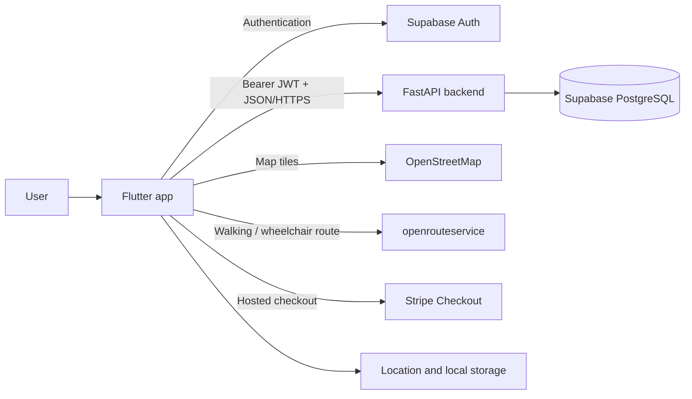
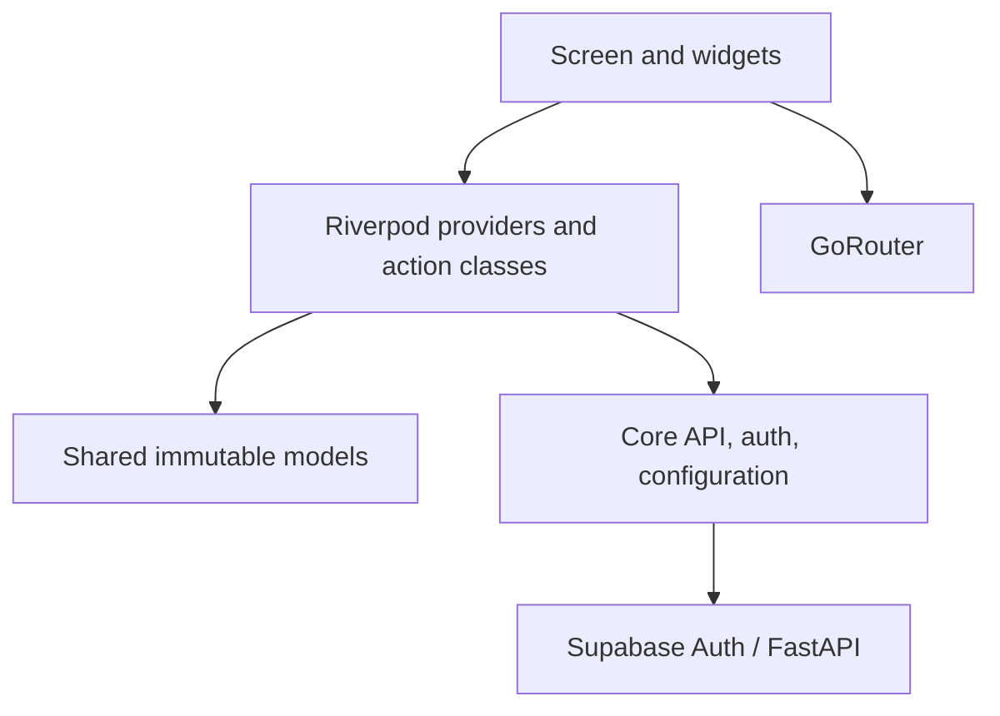

# FROMO Mobile Architecture

This document describes the architecture implemented in `mobile/`. It is the
reference for where new code belongs, how data moves through the app, and which
boundaries should be preserved as the product grows.

## 1. System context

FROMO Mobile is a Flutter application targeting Android, iOS, and Web. It lets
students discover nearby events, inspect crowd levels and accessible routes,
save events, book or pay for tickets, and manage their profile.



The mobile app talks directly to Supabase only for authentication. Business
data goes through the FastAPI backend so authorization, pricing, booking rules,
and database access stay centralized.

## 2. Technology choices

| Concern | Choice | Responsibility |
| --- | --- | --- |
| UI | Flutter / Material | Cross-platform screens and widgets |
| State and dependency injection | Riverpod | Async state, shared dependencies, action services |
| Navigation | GoRouter | Route matching, auth guards, bottom-tab shell |
| Business API | Dio | JSON requests, timeouts, JWT interceptor |
| Authentication | Supabase Auth | Registration, login, session refresh, logout |
| Secret token storage | `flutter_secure_storage` | Persist the Supabase access token used by Dio |
| Lightweight local state | `shared_preferences` | Feedback cooldowns and pending payment IDs |
| Maps | `flutter_map` + OpenStreetMap | Map rendering and event markers |
| Location | Geolocator + Geocoding | Device position and displayable city name |
| Routing | openrouteservice | Walking and wheelchair route geometry and steps |

## 3. Source layout

```text
lib/
├── main.dart                    # Bootstrap, Supabase initialization, app root
├── core/                        # App-wide infrastructure and configuration
│   ├── api_client.dart          # Dio client and JWT attachment
│   ├── auth_provider.dart       # Supabase auth state and auth actions
│   ├── constants.dart           # Compile-time service configuration
│   ├── router.dart              # Routes and authentication redirects
│   └── theme.dart               # Shared colors and Material theme
├── features/                    # Product capabilities, grouped by feature
│   ├── auth/
│   ├── bookings/
│   ├── events/
│   ├── feedback/
│   ├── map/
│   ├── profile/
│   └── saved/
└── shared/
    ├── models/                  # JSON/domain models shared by features
    └── widgets/                 # Reusable app-level widgets and navigation shell
```

Platform folders (`android/`, `ios/`, and `web/`) should contain only platform
configuration and Flutter-generated host code. Product behavior belongs in
`lib/` unless it requires a native platform integration.

## 4. Runtime layers and dependency direction

The current code uses a pragmatic feature-first architecture with four logical
layers:



- **Presentation:** screens render `AsyncValue` state, collect input, and invoke
  actions. Local, short-lived UI state such as the selected map marker or sheet
  position remains inside the widget.
- **Application state:** Riverpod providers load server data and expose action
  classes such as `EventActions`, `BookingActions`, and `AuthActions`.
- **Domain/data models:** `Event`, `Venue`, `Booking`, and composite list items
  parse the backend response and provide display-oriented computed properties.
- **Infrastructure:** `ApiClient` owns HTTP behavior; Supabase owns session
  state; configuration selects service endpoints.

Dependencies should point inward toward models and shared infrastructure.
Features may use shared code, but shared code must not import a feature. Direct
feature-to-feature imports are acceptable only for genuinely shared state (for
example, event payment status derives from the bookings provider); repeated
cross-feature coupling is a signal to move the contract into `shared/` or a
dedicated application service.

## 5. Bootstrap and authentication

`main.dart` initializes Flutter and Supabase before creating a root
`ProviderScope`. `FroMoApp` then keeps the API token synchronized with Supabase
auth changes:

1. Supabase restores or creates a session.
2. The app writes the session access token to secure storage.
3. `ApiClient` reads that token before each request and adds
   `Authorization: Bearer <token>`.
4. Signing out clears both the Supabase session and the stored API token.

This makes public API calls work without a session while allowing protected
backend endpoints to validate the same Supabase JWT. Secure-storage failures
are deliberately non-fatal so public pages still load in restricted embedded
browsers.

`GoRouter` applies the UI-level access policy:

- `/map` and `/events/:id` are public.
- `/saved`, `/bookings`, and `/profile` require authentication.
- `/login` and `/register` redirect authenticated users to `/map`.

The backend remains the security boundary. Router redirects improve user
experience but must never be treated as authorization.

## 6. Navigation

The app starts at `/map`. A `ShellRoute` supplies the persistent bottom
navigation for the Map, Saved, Bookings, and Profile tabs. Event details are
presented outside the shell as a full-screen route. The event detail screen can
return to the map with `?routeTo=<event-id>` to start directions.

| Route | Access | Screen |
| --- | --- | --- |
| `/map` | Public | Event map and feed |
| `/events/:id` | Public | Event details, save, booking, checkout |
| `/saved` | Authenticated | Current user's saved events |
| `/bookings` | Authenticated | Current user's bookings |
| `/profile` | Authenticated | Account summary, feedback, logout |
| `/login` | Signed-out users | Login |
| `/register` | Signed-out users | Registration |

Route paths are application contracts. Prefer named constants or a centralized
route helper if path construction becomes more complex.

## 7. State-management conventions

Riverpod has three distinct roles in this codebase:

- `Provider` exposes stable dependencies and command objects, such as
  `apiClientProvider` and `eventActionsProvider`.
- `FutureProvider.autoDispose` loads server-backed screen data. Family
  providers key event details, payment state, and paginated feeds by request.
- `StateNotifierProvider` owns multi-step mutable state such as permission and
  device-location acquisition.

After a mutation, the action invalidates every affected query provider. For
example, saving an event invalidates `savedEventsProvider`; cancelling a
booking invalidates `myBookingsProvider`. New mutations must follow the same
rule so separate screens do not display stale data.

Use widget state for ephemeral presentation state that is not shared outside a
screen. Promote state to Riverpod when it is shared, survives widget rebuilds,
or represents remote data.

## 8. Main feature data flows

### Event discovery

1. `locationProvider` requests location permission and obtains the device
   position. If unavailable, the map falls back to Times Square.
2. `eventFeedPageProvider` loads active events from `GET /events/`, either
   within 1 km or within the current two-day feed window.
3. Venue details are fetched to enrich embedded venue summaries with category
   and accessibility data.
4. `busynessAreasProvider` loads `GET /busyness/nearby` and currently falls
   back to sample Manhattan data when the API has no usable result.
5. `MapScreen` handles display-only filtering, marker clustering, pagination,
   selection, and map-sheet behavior locally.

### Event details and saving

`eventDetailProvider` combines `GET /events/{id}` and `GET /venues/{venue_id}`.
Saved state comes from `savedEventsProvider`; save and unsave commands update
the API and invalidate that provider so the Saved tab and detail bookmark stay
consistent.

### Booking and payment

Free bookings call `POST /bookings/`. Paid bookings create a hosted checkout
with `POST /payments/checkout-session` and open the returned Stripe URL. The
pending payment ID is stored locally and reconciled with
`GET /payments/{payment_id}` and `GET /bookings/me` when the app resumes.
Cancellation uses `PATCH /bookings/{booking_id}`.

The backend is authoritative for price, capacity, booking status, and payment
status. Client-side computed values are for presentation only.

### Feedback

`FeedbackService` keeps launch counts and cooldown timestamps in local
preferences. Authenticated users become eligible after three launches. Dismiss
and submission cooldowns are seven and thirty days respectively. Submission is
sent to `POST /feedback/` through an injected callback, which keeps the policy
logic unit-testable.

## 9. API and model contracts

All business requests pass through `ApiClient`. Its base URL is selected in
this order:

1. `--dart-define=API_BASE_URL=...`
2. Hosted backend default on Web
3. Android emulator host loopback on native builds

Routing uses `--dart-define=ORS_API_KEY=...`. Compile-time values bundled into
a client application are not secrets; service providers must restrict keys by
allowed API, origin, quota, and environment.

Models use explicit `fromJson` factories and preserve backend snake_case field
names at the serialization boundary. Money is represented as integer cents and
timestamps as `DateTime`. Composite responses such as `{booking, event, venue}`
have dedicated list-item types.

When an API response changes, update its model, provider, tests, and this
document together. Avoid passing unparsed `Map<String, dynamic>` values into
widgets.

## 10. Error and fallback strategy

The app currently distinguishes between recoverable discovery failures and
user-action failures:

- Location failure uses a default center so discovery remains usable.
- Empty or unavailable crowd data uses temporary sample areas.
- Routing failure draws a clearly identified approximate route.
- Event-feed failures return an empty page.
- Save, booking, payment, login, and cancellation failures propagate to the UI
  so the user receives feedback.

Fallbacks must not imply successful payment, booking, authentication, or data
mutation. Broad catches are acceptable only when there is a safe, visible
fallback; otherwise preserve the error for the presentation layer.

## 11. Testing and quality gates

Tests are split by responsibility:

```text
test/unit/          Provider, service, and model behavior
test/widgets/       Screen and reusable-widget behavior
integration_test/   Cross-screen navigation and core flows
test/mocks/         Injectable test doubles such as MockApiClient
```

The pull-request CI installs locked dependencies, runs `flutter analyze`, and
runs `flutter test`. Before merging a mobile change, run:

```bash
cd mobile
flutter pub get --enforce-lockfile
flutter analyze
flutter test
```

Changes to navigation or a user journey should also run the relevant
integration tests on a supported device.

## 12. Adding a feature

1. Create `lib/features/<feature>/` and keep its screen, providers, actions, and
   feature-only widgets together.
2. Reuse models from `shared/models/`, or add a typed model if the backend
   introduces a new contract.
3. Access HTTP through `apiClientProvider`; do not construct a second business
   API client inside a screen.
4. Expose server state with an auto-disposed provider and mutations through an
   action class.
5. Invalidate all affected providers after a successful mutation.
6. Register navigation in `core/router.dart` and explicitly decide whether the
   route is public, protected, inside the tab shell, or full-screen.
7. Add unit tests for parsing/state logic and widget tests for important UI
   states: loading, data, empty, error, and mutation failure.

## 13. Known architectural debt

- `MapScreen` contains routing, clustering, filtering, pagination, and a large
  widget tree. These should be extracted into focused services/controllers and
  widgets as the feature evolves.
- Venue enrichment performs one request per unique venue. The backend should
  include complete venue summaries or expose a batch endpoint to avoid an N+1
  request pattern.
- Crowd-level sample data is compiled into the provider and can hide an empty
  production dataset. Remove it once the backend is populated and distinguish
  empty data from transport failure.
- API errors are not normalized into typed failures, which makes consistent
  retry and user messaging difficult.
- Configuration defaults are production-oriented and not separated into
  explicit development, staging, and production environments.
- The router currently declares the event-detail path both outside and inside
  the shell. Keep a single canonical full-screen declaration to avoid ambiguous
  route ownership.
- Some feature providers import state from another feature. If this grows,
  introduce repository/application-service boundaries instead of creating a
  web of feature-to-feature dependencies.

## 14. Architecture decisions

### Flutter for all client platforms

One Dart codebase provides consistent behavior across Android, iOS, and Web and
keeps a small team from maintaining separate native clients.

### Feature-first organization

Files that change for one product capability live together. This scales better
for a product team than global `screens/`, `services/`, and `providers/`
folders, while `core/` and `shared/` remain reserved for truly cross-cutting
code.

### Riverpod over global singletons

Providers make dependencies replaceable in tests, represent async loading and
error states explicitly, and provide targeted cache invalidation after writes.

### FastAPI as the business-data boundary

The client uses Supabase directly for authentication only. Bookings, payments,
profiles, feedback, events, venues, and busyness data go through FastAPI so
business rules and privileged database access cannot be bypassed by modifying
the client.

### Hosted checkout instead of card collection in Flutter

Stripe Checkout keeps sensitive payment entry outside the app. The client
stores only a payment identifier and treats backend-confirmed status as the
source of truth.

### Graceful degradation for discovery

Map discovery should remain useful when location, geocoding, routing, or crowd
data is unavailable. This principle does not apply to transactional operations,
which must fail explicitly rather than guess.
